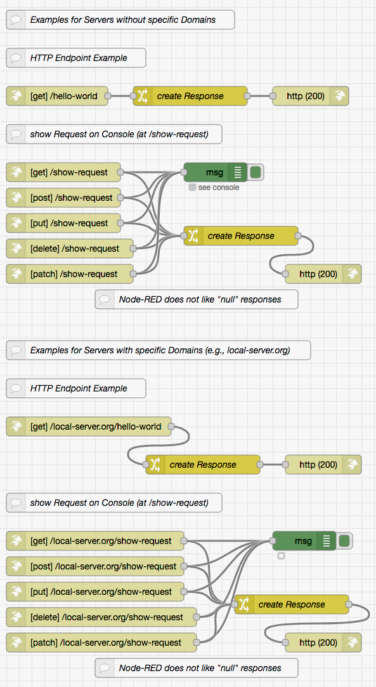

# node-red-within-express #

This repository contains an HTTP server based on [Node.js](https://nodejs.org/en/) with [Express.js](http://expressjs.com/) including an embedded [Node-RED](https://nodered.org/) instance.

Its intended purpose is to provide a very easily maintainable server for development and test of web and REST service prototypes.

> Just a small note: if you like this contribution and plan to use it, consider "starring" this repository (you will find the "Star" button on the top right of this page), so that I know which of my repositories to take most care of.

## Features ##

The implemented server has the following features:

* **HTTPS with optional HTTP-to-HTTPS Redirection**<br>the main server handles HTTPS only as it is becoming increasingly difficult to deliver pure HTTP content to browsers (even locally). If desired, an additional auxiliary HTTP server may be started which redirects incoming requests to its HTTPS counterpart
* **Proxy Support**
* **Support for "self-signed" or "Let's Encrypt" Certificates**<br>for local tests, it may be sufficient to generate self-signed certificates (instructions can be found below). For public tests, the server also supports certificates generated by ["Let's Encrypt"](https://letsencrypt.org/)
* **Support for "virtual Hosts" and Subdomains**<br>the server may optionally support "virtual hosts" and serve multiple domains (including subdomains) simultaneously. In this case, each domain will be mapped to an individual file system subtree in order to isolate the domains from each other
* **"www" Subdomains**<br>if desired, "www" subdomains can be mapped to their original domain (since they usually serve the same content anyway)
* **embedded Node-RED runtime**<br>incoming requests will first be compared to the entry points given by "HTTP in" nodes - and their flows be executed whenever the URL paths match (if "virtual hosts" are to be respected, all these entry points become domain-specific and their paths must therefore be prefixed by the domain they belong to). Requests not matching any "HTTP in" node entry points will then be used to serve static files from the file system (or generate a 404 response if no matching file could be found)
* **embedded Node-RED editor**<br>the embedded Node-RED editor is generally protected by "basic HTTP authentication": for that purpose, the server always comes with a "User Registry" which already contains a single user (named "node-red" with the initial password "t0pS3cr3t!") who is allowed to access the Node-RED editor
* **Path-specific static File Protection**<br>most static files on this server may be available to the public - but perhaps not all of them. For that purpose, this server allows to specify which files should only be available to specific users
* **User Registry with PBKDF2 hashed Passwords and Role Support**<br>the list of registered users is stored in a JSON file with passwords saved as PBKDF2 hashes with random salt. While the server itself does not contain any user management, such a feature may easily be added as a Node-RED flow - although, in fact, a simple text editor is already sufficient to add new users, change existing ones or remove obsolete users
* **Path-specific CORS**<br>"Cross-Origin Resource Sharing" may be configured for complete sites as a whole or for specific resource paths with any desired granularity
* **configurable "Content Security Policies"**<br>the server is secured using [Helmet](https://github.com/helmetjs/helmet) with a configuration option for specific "Content Security Policies"
* **standard-compliant Logging**<br>access logging is done using [morgan](https://expressjs.com/en/resources/middleware/morgan.html). Logs may be written into a file either in "standard Apache common log format" or any other format

## Installation and Use ##

You may easily install and run this server on your machine.

Just install [NPM](https://docs.npmjs.com/) according to the instructions for your platform and follow these steps:

1. either clone this repository using [git](https://git-scm.com/) or [download a ZIP archive](https://github.com/rozek/node-red-within-express/archive/refs/heads/main.zip) with its contents to your disk and unpack it there 
2. open a shell and navigate to the root directory of this repository
3. run `npm install` in order to install the server

### Preparing the first Start ###

For a quick start, the server comes preconfigured for two different use cases:

* ***without* virtual hosts processing**<br>this variant does not require much preparation and is ideal for initial experiments
* ***with* virtual hosts processing**<br>this variant requires a bit of preparational work but may be used to test installations serving multiple domains

#### Preparing a Server *without* virtual Hosts Processing ####

Using HTTPS to access servers with self-signed certificates cause warnings in most browsers, other tools may even refuse to work. In many browsers, it is sufficient to follow the presented instructions and accept the "malicious" certificate against all warnings (which is safe, since you created the certificate yourself). For other tools, it may be better to add the certificate to the system's list of trusted certificates.

You will have to accept the certificate for `localhost` when you start your server and navigate to one of its pages for the first time. However, the configured exception will only last for a few minutes and will then have to be repeated.

> Chromium-based browsers (such as Chrome or Microsoft Edge) offer a special flag which automatically accepts certificates for `localhost`: just enter `chrome://flags/#allow-insecure-localhost` (or `edge://flags/#allow-insecure-localhost`) into the browser's address list, press Enter and activate the flag on the page you will be shown

#### Preparing a Server *with* virtual Hosts Processing ####

Using HTTPS to access servers with self-signed certificates cause warnings in most browsers, other tools may even refuse to work. In many browsers, it is sufficient to follow the presented instructions and accept the "malicious" certificate against all warnings (which is safe, since you created the certificate yourself). For other tools, it may be better to add the certificate to the system's list of trusted certificates.

You will have to accept the certificate for `local-server.org` when you start your server and navigate to one of its pages for the first time. However, the configured exception will only last for a few minutes and will then have to be repeated.

In order to be able to directly navigate to `localserver.org` and its subdomains, you will have to append the following entries to the file `/etc/hosts` (under Windows, this file is found at `%windir%\system32\drivers\etc\hosts`):

```
  127.0.0.1 local-server.org
  127.0.0.1 www.local-server.org
  127.0.0.1 webapp.local-server.org
```

Any text editor will do the job.

### First Experiments ###

On UNIX-like systems, the available start scripts should be made executable in order to simplify their invocation:

```
chmod +x startServer*
```

Under Windows, the first line of these scripts (the "shebang" line) may have to be deleted instead.

Now you are ready to start your server: within a terminal window, navigate to the folder containing this repository and either enter

```
./startServerWithDomains
```

or

```
./startServerWithoutDomains
```

depending on the scenario you want to test.

As soon as the server has started up (it reports this process on stdout) you may use a browser of your choice and navigate to `localhost:8443` or `local-server.org:8443`, resp. As a result, the browser should show you a simple web page with a small image and the server should have logged two requests on the console. This experiment proves that static files are delivered properly

Go further and navigate to `localhost:8443/hello-world` (or `local-server.org:8443/hello-world`, resp.). The browser should now show the text `Hello, World!` - a text that has been generated by Node-RED.

Next, navigate to `localhost:8443/show-request` (or `local-server.org:8443/show-request`, resp.). The browser should now show the text `(see Node-RED debug console)` which reminds you to open the Node-RED editor and have a look into its debug window.

Thus, open a new tab in your browser and navigate to `localhost:8443/.Node-RED/Editor` (or `local-server.org:8443/.Node-RED/Editor`, resp.). Instead of showing anything, your browser should first ask you to authenticate yourself: enter `node-red` as your user name and `t0pS3cr3t!` as your password (exactly as shown here). If you mistyped anything, the browser will present the authentication dialog again. Otherwise, the Node-RED editor will be opened and you will see a workspace with the initial set of flows that came with this server.

Open the debug output, switch back to the previous browser tab and reload the page you requested before (either `localhost:8443/show-request` or `local-server.org:8443/show-request`). Switch back to the Node-RED editor and inspect the debug window: you should now be able to inspect the request your browser sent to the server.

You are welcome to test that `show-request` with the HTTP methods `PUT`, `POST`, `PATCH` and `DELETE` as well - e.g., using tools like [cURL](https://curl.se/) or [Postman](https://www.postman.com/).

As usual, all requests should have been logged both on the console and in a file called `localhost.log` (or `local-server.log`, resp.) within subfolder `logs`.

## Invocation Parameters ##

The server in this repo has been implemented as a Node.js script and can be invoked as follows

```
node WebServer.js [options] <file-root> [<configuration-folder> [<log-folder>]]
```

with the following arguments:

* **`<file-root>`**<br>specifies the root folder (relative to the server's current working directory) of all deliverable static files. By default, this is a subfolder of the current working directory called `public`
* **`<configuration-folder>`**<br>specifies the folder (relative to the server's current working directory) where configuration files (such as the list of registered users) are found. By default, this is the current working directory itself
* **`<log-folder>`**<br>specifies the folder (relative to the server's current working directory) into which the log file is written. By default, this is a subfolder of the current working directory called `logs`

The following options are supported:

* **`--server-port <port>`**<br>specifies the TCP port at which to listen for incoming HTTPS requests. The default is `8443`
* **`--redirection-port <port>`**<br>if provided, this option activates HTTP-to-HTTPS redirection and specifies the TCP port at which to listen for incoming HTTP requests
* **`--proxy <proxy>`**<br>activates and configures proxy support. Consider the [Express.js documentation](https://expressjs.com/en/guide/behind-proxies.html) for a list and explanation of actually allowed values
* **`--domain <domain>`**<br>specifies the primary domain of this server. It should be the "common name" (CN) of the associated server certificate and also appears in the log file name. If virtual hosts are given as well (even if the list is empty), the primary domain is automatically added to that list
* **`--virtual-hosts <virtual-hosts>`**<br>activates virtual hosts processing and configures the domains to handle. The given argument may either be an empty string (`""`) or a string containing a comma-separated list of internet domains. All mentioned domains should also be specified as "subject alternative names" (SAN) in the server certificate
* **`--allow-subdomains`**<br>if specified, all subdomains of the given primary domain and virtual hosts are processed as well. In this case, the server certificate should also contain "subject alternative names" (SAN) with wildcards of the form `*.<domain>`
* **`--ignore-www`**<br>if specified, subdomains of the form `www.<domain>` are not treated as a separate subdomain but mapped to their main `<domain>`
* **`--cert-folder <folder>`**<br>specifies the folder where to find server certificates. By default, this is a subfolder of the server's current working directory called `certificates`
* **`--pbkdf2-iterations <count>`**<br>specifies the number of iterations when computing PBKDF2 hashes. Default is 100000
* **`--log-format <format>`**<br>specifies the format in which log entries are written into a file. Consider the [morgan documentation](https://expressjs.com/en/resources/middleware/morgan.html) for a list and explanation of permitted settings. Default is `common`

If everything works well, the server reports its start-up and logs all incoming requests on `stdout`

### Configuring Domains and Virtual Hosts ###

On a "production system", usually no special precautions need to be taken to run this server.

Synthetic tests with virtual hosts on a local machine, however, should be prepared as follows:

* generate self-signed certificates for all domains under test:<br>folder `certificates` contains a file `local-server.org.cnf` which can be used for that purpose
  * copy this file and name the copy `<primary-domain>.cnf` where "&lt;primary-domain&gt;" should be replaced by the name of your primary domain
  * create a subfolder with the name of your primary domain
  * open `<primary-domain>.cnf` in a text editor of your choice
  * replace `local-server.org` with your primary domain (both behind `CN =` and `DNS.1 =`)
  * append additional domain names as further `DNS.#` entries at your will
  * save this file and run the following command<br>`openssl req -x509 -nodes -newkey rsa:4096 \`<br>`-keyout <primary-domain>/privkey.pem \`<br>`-out <primary-domain>/fullchain.pem \`<br>`-days 3650 -config <primary-domain>.cnf`<br>(again, after replacing "&lt;primary-domain&gt;" with the name of your primary domain)
* append an entry for each desired domain to `/etc/hosts`. Each entriy must have the form<br>&nbsp; &nbsp; `127.0.0.1 <primary-domain>`<br>wildcards are not allowed
* modify the script `startServerWithDomain` by replacing `local-server.org` with the name of your primary domain and - if need be - adding a `--virtual-hosts` option with a comma-separted list of additional domain names (subdomains of your primary domain do not have to be mentioned explicitly, the option `--allow-subdomains` already covers them)

You may now run `startServerWithDomain` and navigate your browser to any of the configured domains (don't forget to specify your server's port number unless it is a standard one)

## Embedded Node-RED Instance ##

The embedded Node-RED instance comes with two sets of flows for initial "smoke tests": one for a server *with* virtual host processing and one *without*.
A GET request to `/hello-world` simply responds with a "Hello, World!" message, GET, PUT, POST, PATCH and DELETE requests to `show-request` dump the contents of any incoming message to the Node-RED debug window.



Both flow sets are welcome to be removed and replaced with more meaningful ones.

For your own flows, the following server parameters are copied into the global context:

* **`ServerPort`**<br>contains the port number at which this server listens for incoming requests
* **`RedirectionPort`**<br>is either `undefined` or contains the port number of the redirection server
* **`behindProxy`**<br>is either `false` or contains the setting given in command option `--proxy`
* **`primaryDomain`**<br>is either `undefined` or contains the primary domain name for this server
* **`virtualHosts`**<br>contains a (potentially empty) JavaScript array with the names of all domains handled by this server
* **`allowSubdomains`**<br>is `true` if subdomains are allowed or `false` otherwise
* **`PBKDF2Iterations`**<br>contains the number of PBKDF2 iterations calculated when generating password hashes
* **`FileRoot`**<br>contains the absolute path of the root folder containing all static files which may be delivered by this server
* **`ConfigRoot`**<br>contains the absolute path of the folder containing any server configuration files
* **`LogRoot`**<br>contains the absolute path of the folder into which logs are written
* **`CORSRegistry`**<br>contains the JavaScript array with all CORS rules. The array is copied "by reference" which means that changes in this array immediately affect the server itself (no server restart required)
* **`UserRegistry`**<br>contains the JavaScript object with all registered users. The object is copied "by reference" which means that changes in this object immediately affect the server itself (no server restart required)

## User Registry ##

The server comes with a file `registeredUsers.json` which contains all "registered users" of this server.
Initially, it contains a single user named "node-red" with password "t0pS3cr3t!" who is needed to access the embedded Node-RED editor.
New users may be added and existing users changed or deleted at will with a simple text editor.

`registeredUsers.json` contains the JSON serialization of a JavaScript object with the following format:

* the object's property names are the ids of registered users<br>user ids have no specific format, they may be user names, email addresses or any other data you are free to choose - with **two important exceptions: user ids must neither contain any slashes ("/") nor any colons (":")** or some authentication or user management mechanisms (like those described in [node-red-authorization-examples](https://github.com/rozek/node-red-authorization-examples) or in the [node-red-user-management-example](https://github.com/rozek/node-red-user-management-example)) may fail
* the object's property values are JavaScript objects with the following properties, at least (additional properties may be added at will):
  * **Roles**<br>is either missing or contains a list of strings with the user's roles. There is no specific format for role names - just the role `node-red` has a special meaning: users with this role are allowed to access the embedded Node-RED editor
  * **Salt**<br>contains a random "salt" value which is used during PBKDF2 password hash calculation
  * **Hash**<br>contains the actual PBKDF2 hash of the user's password

The server will not start if file `registeredUsers.json` is missing or does not have valid JSON content.

Users without proper `Salt` and `Hash` values can not authenticate themselves. Those without role `node-red` can not access the embedded Node-RED editor

> Nota bene: Node-RED *flows* work independent of the embedded editor's accessability!

### Generating "Salt" and "Hash" ###

This repo also contains a small utility called `generateSaltAndHash` which may be used to generate the "Salt" and "Hash" values for entries in the user registry.

From within the folder containing the repository, it is invoked with

```
./generateSaltAndHash
```

The script will ask for a password and - as soon as the password has been entered - generate salt and hash values and display them on the console. From there, these values may be copied into the clipboard and added to `registeredUsers.json`.

By default, `generateSaltAndHash` assumes a PBKDF2 iteration count of 100000. If another count is desired, the utility should be invoked with

```
./generateSaltAndHash pbkdf2-iterations <count>
```

## Static File Protection ##

By default, all static files are considered "public", i.e. available to any visitor without prior authentication.

If desired, however, it is possible to specify, which files should only be available to specific users (who then have to authenticate themselves before they are allowed to access these protected files). Such rules can be specified in file `protectedFiles.json` which is found in the configured `<configuration-folder>`.

This file contains the JSON serialization of a JavaScript object with the following format:

* the object's property names are regular expression (RegExp) patterns which are compared against any incoming URL path (including the domain name, if virtual hosts are to be processed) 
* the object's property values are strings which either contain a single asterisk ("`*`") indicating that any authenticated user may access, or a blank separated list with the names of those users who are allowed to access the matching file.

The example that comes with this server protects all files and folders whose names start with a dot (".") and (in the case of protected folders) their contents.

The server will not start if file `protectedFiles.json` is missing or does not have valid JSON content.

## CORS Support ##

"Cross-Origin Resource Sharing" ([CORS](https://en.wikipedia.org/wiki/Cross-origin_resource_sharing)) instructs browsers to restrict resource access to specific domains. For this server, CORS behaviour can be specified in file `sharedResources.json` which is found in the configured `<configuration-folder>`.

This file contains the JSON serialization of a JavaScript array containing objects with the following format:

* property `PathPattern` contains a regular expression (RegExp) pattern which is compared against any incoming URL path (including the domain name, if virtual hosts are to be processed)
* property `OriginList` is either `null` (which acts as a placeholder allowing unrestricted resource sharing) or a JavaScript array containing the names (without protocols or port numbers) of all domains which are allowed to request the matching resource (whereas any domain not mentioned in this list is not allowed to access the resource)

Without any entries, browser settings apply (which are often quite restrictive)

The server will not start if file `sharedResources.json` is missing or does not have valid JSON content.

## Content Security Policies ##

Browsers constantly impose tighter security restrictions on HTML pages. If certain facilitations are needed, they can be entered in a file called `ContentSecurityPolicies.json` which is found in the configured `<configuration-folder>`.

This file contains the JSON serialization of a JavaScript object with the following format:

* the object's property names are "Content Security Policies" (CSP) "directives"<br>see [the documentation at MDN](https://developer.mozilla.org/en-US/docs/Web/HTTP/CSP) for a list and explanation of available directives
* the object's property values are JavaScript arrays containing a list of policies for the given directive (see [MDN](https://developer.mozilla.org/en-US/docs/Web/HTTP/Headers/Content-Security-Policy/default-src) for a list and explanation of such policies)

The server will not start if file `ContentSecurityPolicies.json` is missing or does not have valid JSON content.

## Logging ##

The server uses [morgan](https://expressjs.com/en/resources/middleware/morgan.html) for the formatting of log entries.

Two logs are written: a simplified one (which allows to monitor server operation) is written to `stdout`, an extended one into a file named after the configured primary domain (or `localhost`) within the configured `<log-folder>`.

Unless this has been changed, the larger log file follows the "standard Apache common log format" and may be processed using standard log file analysis tools. Other log format may be configured with command option `--log-format <format>`

## License ##

[MIT License](LICENSE.md)
